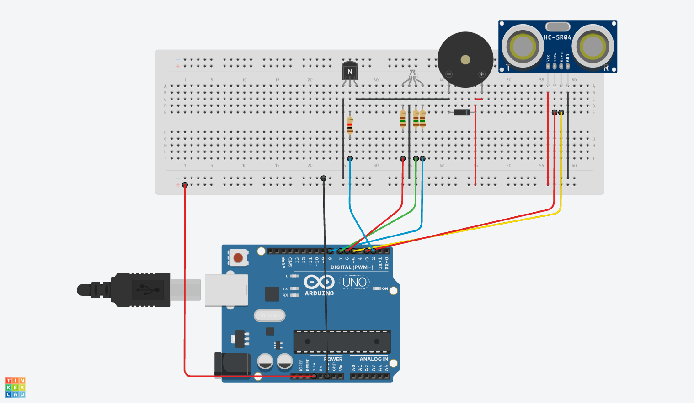

Copyright 2022 Vasile Alexandru-Gabriel (vasilealexandru37@gmail.com)

# DEEA Proiect: Senzor de distanta cu semnale luminoase si acustice.

### Proiectul propune realizarea unui senzor de parcare, care pentru anumite distante predefinite returnate de senzorul cu ultrasunete, emite diferite culori si sunete.

### Bill of materials:
* 1x Arduino microcontroller
* 1x Transistor
* 1x RGB led
* 1x Breaboard
* 1x Buzzer
* 1x HC-SRO4
* 1x Diode
* 3x 150 ohm Rezistor
* 1x 1000 ohm Rezistor
* 15x male-to-male wires